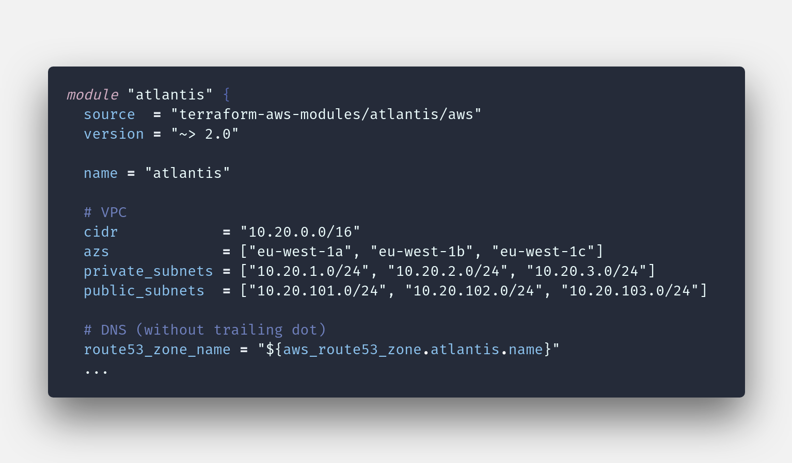

<!-- This file is used by `mdctl`. Make all changes to `README.yaml` and run `mdctl build` to rebuild this file. -->

<p align="center">



</p>


<h1 align="center">docker-atlantis-terragrunt</h1>

This is an open source project published by The Scale Factory.

We currently consider this project to be hibernating.

These are projects that we’re no longer prioritising, but which we keep ticking over for the benefit of the few customers we support who still use them.

:information_source: We’re not regularly patching these projects, or actively watching for issues or PRs. We’ll periodically make updates or respond to contributions if one of the team has some spare time to invest.


<h4 align="center">A Docker image for running Atlantis with Terragrunt</h4>


<p align="center">

[](https://github.com/scalefactory/docker-atlantis-terragrunt) 

</p>


## :sparkles: Features
- Docker image to run Terragrunt with Atlantis
- SSH key support to access private repositories


## :bulb: Quick Start
You can find example terraform in the `examples` folder.

Deploy the reference
[Atlantis Terraform module](https://github.com/terraform-aws-modules/terraform-aws-atlantis)

Tweak the `custom_environments_secret_secrets` and `atlantis_image` variables.
Put your private SSH key into AWS secrets manager under the
`/atlantis/github/user/private_ssh_key` path

```
# terraform-aws-modules/terraform-aws-atlantis
...
custom_environment_secrets = [
  {
    name  = "GITHUB_USER_SSH_KEY"
    valueFrom = "/atlantis/github/user/private_ssh_key"
  }
]
atlantis_image = "scalefactory/docker-atlantis-terragrunt:v0.19.20"
...
```

*Note:* You will need to grant the Fargate task permission to read the secret
above.


## :page_facing_up: Examples
Copy the Terraform in the examples folder.

We recommend creating a dedicated bot GitHub account to run atlantis as. Put a
valid [GitHub personal access
token](https://www.runatlantis.io/docs/access-credentials.html#generating-an-access-token)
for this user into secrets manager with the key `token`. Note down the ARN for
this secret, you will need it later.

Set the following Terraform variables

| Name | Description | Type | Default | Required |
|------|-------------|:----:|:-----:|:-----:|
| github_secret_token_arn | The arn of the github token in Secrets Manager  | string | `` | yes |
| github_user | The name of the github user Atlantis will run as (@sfatlantisbot). | string | `` | yes |
| domain | The domain to run atlantis under (example.com).  | string | `` | yes |


## :page_facing_up: License
docker-atlantis-terragrunt is an open-sourced software licensed under the [MIT license](LICENSE.md).


## :blue_book: References

- [Atlantis](https://www.runatlantis.io/)
- [Terragrunt](https://github.com/gruntwork-io/terragrunt)
- [Atlantis Terraform module](https://github.com/terraform-aws-modules/terraform-aws-atlantis)
- [Report a bug](https://github.com/scalefactory/docker-atlantis-terragrunt/issues)


## :star: Contributors

|  [![Steve Porter][steveporter92_avatar]][steveporter92_homepage]<br/>[Steve Porter][steveporter92_homepage] |
|---|

  [steveporter92_homepage]: https://github.com/steveporter92
  [steveporter92_avatar]: https://github.com/steveporter92.png?size=150


_This README was generated with :heart: by [**mdctl**](https://github.com/mdctl/mdctl)_
